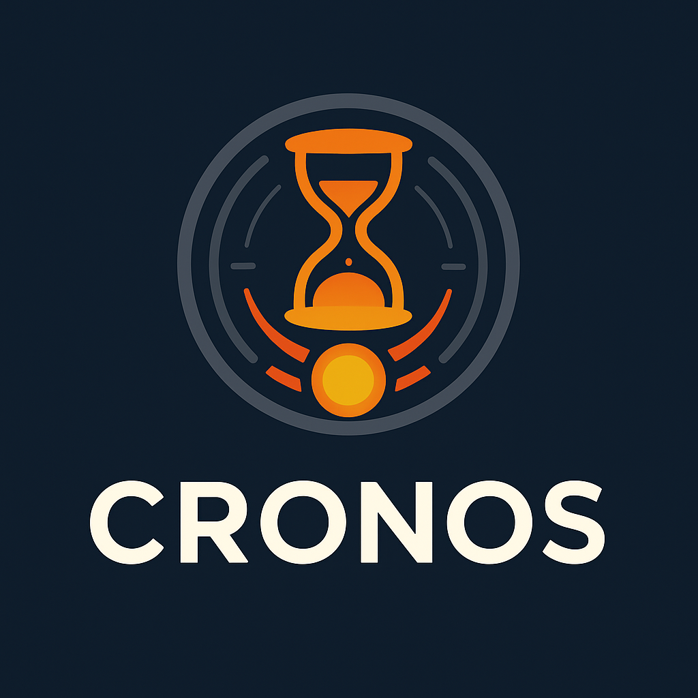

# CRONOS - Collision Runs with Orchestrated Nuclear Observable Simulations

## Overview

CRONOS is a comprehensive framework designed to facilitate the simulation and analysis of nuclear collision events. It integrates various modules for event generation, hydrodynamic evolution, and particle production, providing researchers with a robust toolset for studying high-energy nuclear physics phenomena.

